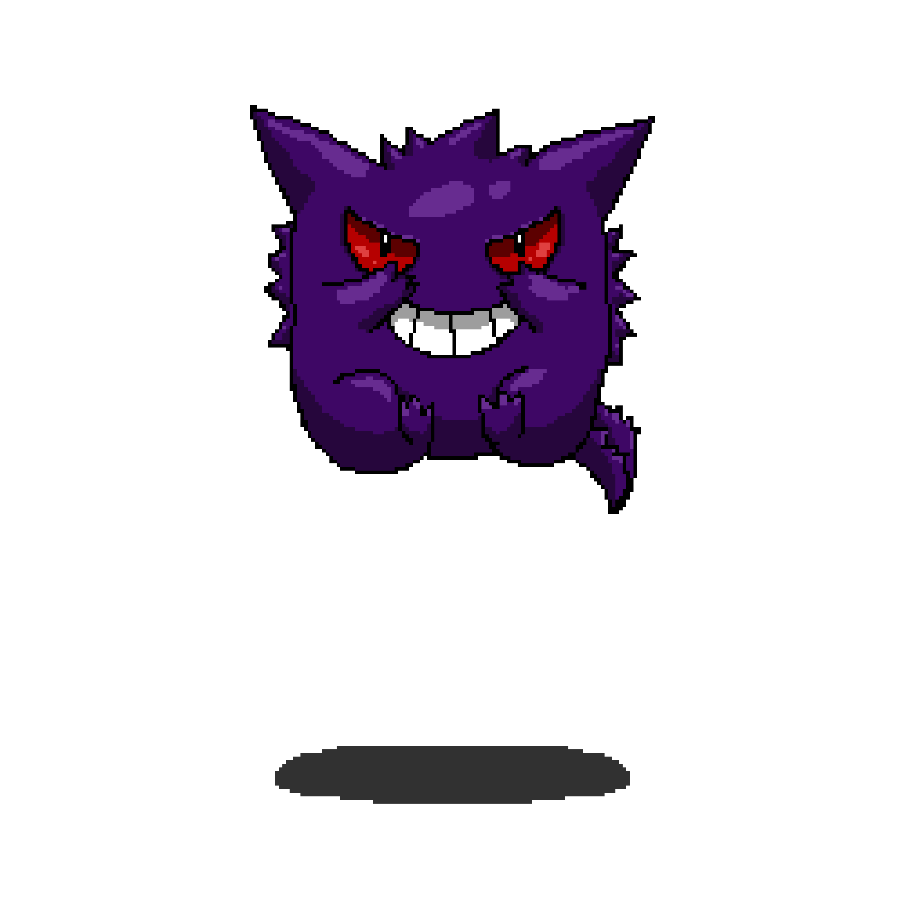

<div align="center">


<br/>

[](https://github.com/Icaro-Costa)
[](https://github.com/Icaro-Costa?tab=followers)

</div>

---

## 🖥️ Sobre mim

```bash
icaro@arch:~$ neofetch
```

<table border="0" cellpadding="10">
<tr>
<td valign="middle">

```
icaro@arch
----------
OS      : Arch Linux x86_64 (btw)
Kernel  : 6.x.x-arch
Shell   : zsh + oh-my-zsh
Editor  : kate  (KDE tem classe)
DE      : nenhum. só terminal mesmo
Uptime  : construindo há anos

Stack   : React · Next.js · TypeScript
Backend : C# · .NET · PostgreSQL
IA      : LangChain · RAG · Claude API
Hobby   : capturar bugs como se fossem pokémon

"Dê poder ao homem e verá quem ele realmente é."
```

</td>
<td valign="middle">

</td>
</tr>
</table>

---

## 🛠️ Tecnologias

**Frontend**


**Backend & Dados**


**IA & Automações**


**Linux & Terminal**


---

## 📌 Projetos em destaque

```bash
icaro@arch:~$ ls ~/projetos/ --long
```

```
drwxr-xr-x  porto-digital-case-14/   -> NeuroMentor: plataforma educacional com IA   [publico]
                                         Next.js 15 . ASP.NET Core . PostgreSQL . Claude API

drwxr-xr-x  neuromentor-backend/     -> Backend C# do NeuroMentor                    [publico]
                                         ASP.NET Core 10 . EF Core . PostgreSQL . Docker

drwxr-xr-x  OFFBAO/                  -> Site para restaurante de bao                 [privado]
                                         (stack em segredo... assim como a receita do bao)
```

<div align="center">

[](https://github.com/Icaro-Costa/porto-digital-case-14)
[](https://github.com/Icaro-Costa/neuromentor-backend)
[](https://github.com/Icaro-Costa/OFFBAO)

</div>

---

## 📊 Stats

<div align="center">

</div>

<div align="center">


</div>

<div align="center">


</div>

<div align="center">


</div>

---

## 📈 Atividade

<div align="center">


</div>

---

## 🏙️ Contribuições

<div align="center">


</div>

---

## 💻 Terminal

```bash
icaro@arch:~$ whoami
# dev que usa arch, captura bugs como pokémon e nunca fecha o vim por acidente
# (uso kate mesmo)

icaro@arch:~$ cat ~/filosofia.txt
"Dê poder ao homem e verá quem ele realmente é."

icaro@arch:~$ pacman -Q | grep skills
react 18.x         [instalado]
nextjs 14.x        [instalado]
dotnet 8.x         [instalado]
langchain 0.x      [instalado]
psyduck 1.0        [instalado — atualização pendente: headache_cure]

icaro@arch:~$ ps aux | grep icaro
icaro   aprendendo   -> sempre rodando
icaro   construindo  -> next.js + .net + ia
icaro   arch linux   -> btw

icaro@arch:~$ █
```

---

## 🌐 Contato

<div align="center">

[](https://github.com/Icaro-Costa)
[](mailto:icaro.developerr@gmail.com)
[](https://www.linkedin.com/in/icaro-costa-ic/)

</div>

---

<div align="center">


</div>
